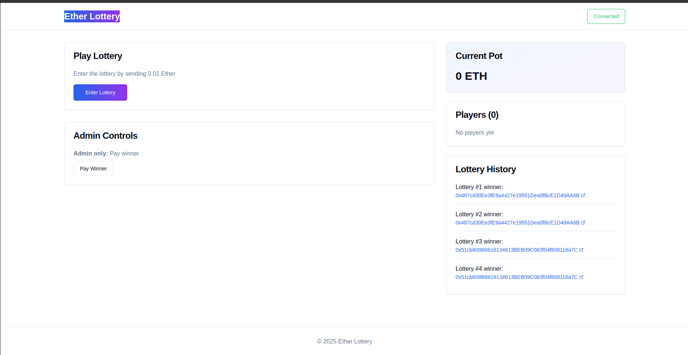
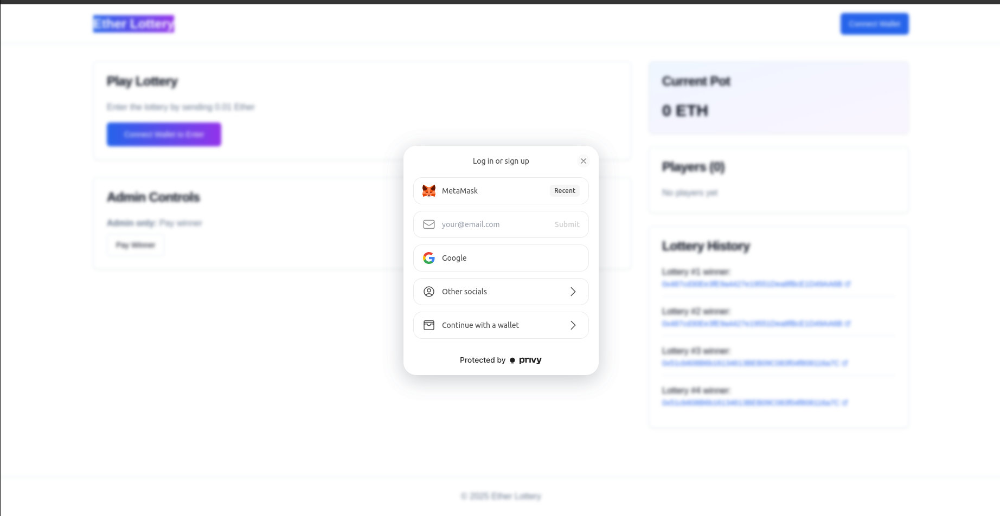
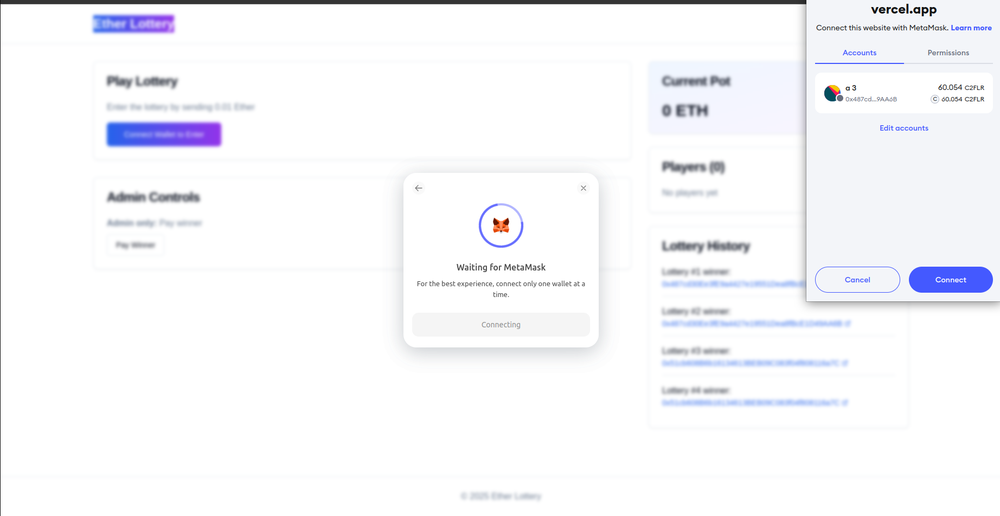

<p align="left">
  
  
  
  
    
  
</p>

## Overview

This project is a decentralized lottery contract built for the **Flare Network** using its random number generator (RandomNumberV2).
Players enter by paying an entry fee. At any time, the contract owner can draw a random winner and distribute the accumulated funds.

## Features

- **Decentralized Lottery**: Trustless and transparent drawing of winners.

- **Randomness Powered by Flare RNG**: Fair random number generation using Flare’s infrastructure.

- **Secure Player Management**: Player entries are securely tracked.

- **Owner Controls**: Only the owner can trigger the drawing of a winner.

- **Modular and Upgradeable**: Randomness source is resolved via ContractRegistry, allowing for flexibility.

## Setup Instructions

### Prerequisites

Before you begin, ensure you have the following installed:

- **Node.js** (v16 or higher)
- **npm** or **yarn** (Node.js package managers)
- **Git** (for cloning the repository)
- **Foundry** (for smart contract development and testing)
- **MetaMask** or any Ethereum wallet (for interacting with the DApp)

### Installation

1. **Clone the Repository**

   - Open your terminal or command prompt.
     ```bash
     git clone git@github.com:claudioussamuel/Lottory-DApp-FTSO.git
     ```
     ```bash
     cd ethereum-lottery
     ```

2. **Install Dependencies**
   - Install all required dependencies by running:
     ```bash
     npm install
     ```
     or if you're using Yarn:
     ```bash
     yarn install
     ```
3. **Set Up Environment Variables**
   - Create a `.env.local` file in the root directory of the project.
   - Add the following environment variables:
     ```env
     NEXT_PUBLIC_PRIVY_APP_ID=your_privy_app_id
     NEXT_PUBLIC_PRIVY_APP_SECRET=your_privy_secret_key
     ```
     - Replace `your_privy_app_id` with your actual Privy App ID (get it from the [Privy Dashboard](https://privy.io/)).

### **Privy Integration Overview**

This project integrates **Privy** to enhance user authentication, wallet management, and blockchain interactions. Below is a concise explanation of each key feature:

---

### **1. Embed Wallet for Social Login**

Privy allows users to log in using **social accounts** (Google, Twitter, etc.) or **email/password**, while seamlessly embedding a wallet for web3 interactions. This bridges the gap between web2 and web3, enabling non-crypto-native users to interact with the blockchain effortlessly.

---

### **2. Privy Provider with viem for Blockchain Interactions**

Privy integrates with **viem**, a lightweight Ethereum library, to facilitate secure and efficient blockchain interactions. This combination enables:

- **Wallet Management**: Privy manages user wallets, while viem handles smart contract calls and blockchain queries.
- **Seamless Integration**: Developers can use viem's APIs to interact with the blockchain, with Privy handling authentication and wallet connections.

---

### **3. Privy for Signing Transactions and Transacting with the Blockchain**

Privy simplifies **transaction signing** and **blockchain interactions** by:

- **Wallet Abstraction**: Users can sign transactions without needing to manage private keys directly.
- **User-Friendly Flows**: Privy provides pre-built UI components for transaction signing, making it easy for users to approve and send transactions.

---

### **4. Privy for Funding the Wallet Through Coinbase**

Privy enables **on-ramp functionality**, allowing users to fund their embedded wallets via **Coinbase** or other payment providers. This feature:

- **Simplifies Crypto Onboarding**: Users can purchase crypto directly within the app.
- **Supports Multiple Payment Methods**: Integrates with Coinbase and other on-ramp providers for seamless funding.

---

### **Summary**

By leveraging Privy, this project delivers a **unified authentication and wallet management solution**, enabling:

- **Social logins** with embedded wallets.
- **Secure blockchain interactions** via viem.
- **Transaction signing** and **on-chain interactions**.
- **Easy wallet funding** through Coinbase and other on-ramp providers.





---

### Additional Notes

- **Smart Contracts**:

  - The project uses **Foundry** for smart contract development, testing, and deployment.
  - Compile, test, and deploy contracts:

    ```bash
    # Compile contracts
    forge build

    # Run tests
    forge test

    # Deploy contracts
    forge script script/Deploy.s.sol --rpc-url <your_rpc_url> --private-key <your_private_key>
    ```

- **Wallet Integration**:

  - The project uses **viem** with **Privy** for wallet connections and blockchain interactions.
  - This combination provides a streamlined user experience while maintaining security.

- **Testing the DApp**:
  - Use testnet stablecoins (e.g., USDC on Sepolia) to simulate payments.
  - Ensure your wallet is connected to the correct Ethereum network (e.g., Sepolia Testnet).

---

### Troubleshooting

- **Environment Variables**: Ensure all required environment variables are set in `.env.local`.
- **Wallet Connection**: If the wallet fails to connect, ensure your wallet (e.g., MetaMask) is installed and unlocked.
- **Transaction Issues**: If transactions fail, check your wallet balance and network connection.
- **Foundry Issues**: Make sure Foundry is properly installed and updated to the latest version.

### Project Structure

---

## **1. Smart Contracts (`/flare-foundry-starter`)**

The `contracts` folder contains all the code related to the blockchain and smart contracts.

### **Key Subfolders:**

- **`test/`**:
  - Contains unit tests and integration tests for the smart contracts.
  - Ensures the contracts function as expected before deployment.
- **`scripts/`**: Houses deployment scripts (e.g., using Foundry) to deploy contracts to various networks (mainnet, testnet, etc.).
  - Stores deployed contract artifacts (ABIs, addresses, etc.) for easy access by the frontend.
- **`src/`**:
  - Contains the main Solidity smart contract files.
  - Organized into logical modules (e.g., `JustPay.sol`).

---

## **2. Frontend (`/ethereum-lottery`)**

The `frontend` folder contains the code for the user interface and application logic.

### **Key Subfolders:**

- **`src/`**:
  - **`app/`**:
    - Contains the main application logic and routing configuration (`appRoutes`).
    - Handles navigation and page rendering based on routes.
  - **`components/`**:
    - Houses reusable UI components (e.g., buttons, modals, cards).
    - Promotes code reusability and maintainability.
  - **Other Files**:
    - Includes utility functions, hooks, and context providers.
- **`.env.local`**:
  - Stores environment-specific variables (e.g., API keys, contract addresses).
  - Ensures sensitive data is not hardcoded into the application.

---

## **3. Benefits of This Structure**

- **Centralized Codebase**: Both frontend and smart contracts are in one place, making it easier to manage dependencies and workflows.
- **Modular Design**: Separates concerns (e.g., contracts, frontend, tests) for better organization.
- **Ease of Deployment**: Deployment scripts and artifacts are stored alongside the contracts, simplifying the deployment process.
- **Reusable Components**: Frontend components are modular and reusable, reducing duplication of code.
- **Environment Management**: `.env.local` ensures sensitive data is securely managed and not exposed in the codebase.

---
